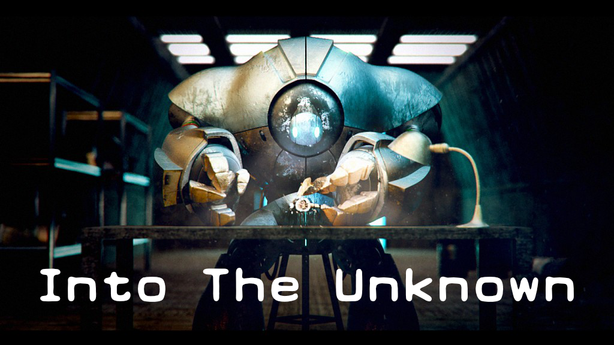
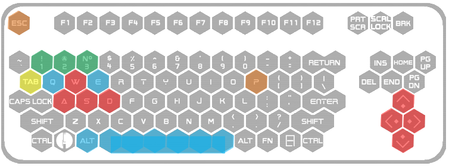

GAME ENGINE II
420-JV9-AS
Marc-Andre Larouche

      
      

-><-

      
7378-Team-I-2020

Sohyun Yi

Sidakpreet Singh

Philipe Gouveia
      
      
      
###############################################################

         
      

**Section 1: About the Game**

      Into the unknown is Puzzle game with a Sci-Fi history atmosphere. In the game the player can control two main characters to solve puzzles throughout all the stages. Aside from the main characters, there is one vehicle which can be used to move from one land station to another. On each of the stations the player will find puzzles to be solved in order to understand the game and to figure out the mystery about the planet. At parts of the game the player might be challenged to take decisions that can alter the end of the game.
      The game happens on the year 287 D.M. The A.I, built by the main character, informs him that, for an UNKNOWN reason, they were switched off for about 13 years, as its database has no data within this time gap. The mystery lies there, as the last thing the A.I remembers is when the engineer has successfully built the sphere, the second playable character. In addition, the only thing the A.I’s sensor can detect is a weak radio signal from a nearby land station. What it might be? 
      
      
      
      
      
      
      
      
      
      
      
**Section 2: About the Manual**

      2.1 – Control Scheme:

-><-

-><-

      2.2 – Important Visuals:

 
      
-><-

  

**Section 4: References**

* Engineer Character Design:
by Papa_Dragon, http://www.blendswap.com/blends/view/75153.
* Sphere Character Design:
By 3DHaupt, https://www.blendswap.com/blend/21770
* Car Vehicle Design:
By Mikel007, http://www.blendswap.com/blends/view/77885
* Keyboard, mouse and joystick icons:
SihanLiu, https://www.iconfinder.com/icons/1536922/controller_elite_gamer_xbox_one_icon
* In-Game Fonts:
Earth 2072 by Lukas Krakora, http://www.typewriterfonts.net
* First level environmental assets:
3D Scifi Starter Kit, https://assetstore.unity.com/packages/3d/environments/3d-scifi-kit-starter-kit-92152
Sci-Fi Modular Pack, https://assetstore.unity.com/packages/3d/environments/sci-fi/sci-fi-modular-pack-free-39538
3D Free modular kit, https://assetstore.unity.com/packages/3d/environments/3d-free-modular-kit-85732
Modular Sci-Fi Corridor, https://assetstore.unity.com/packages/3d/environments/sci-fi/modular-sci-fi-corridor-142811
Sci-Fi Styled Modular Pack, https://assetstore.unity.com/packages/3d/environments/sci-fi/sci-fi-styled-modular-pack-82913
* In-Game UI:
SlimUI, https://assetstore.unity.com/packages/tools/gui/slimui-tech-menu-133049
* Engineer Robot Background:
by Papa_Dragon, http://www.blendswap.com/blends/view/75153
